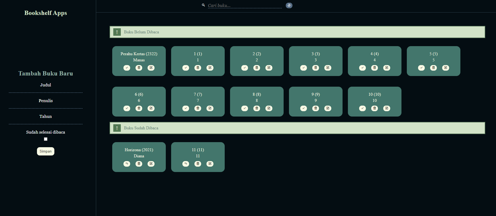

# Dicoding - Submission Aplikasi Pengelolaan Data Menggunakan DOM dan Web Storage

Aplikasi ini merupakan hasil pengembangan untuk submission pada Dicoding dengan fokus pada pengelolaan data menggunakan DOM (Document Object Model) dan Web Storage. Dengan memanfaatkan konsep DOM, aplikasi ini memungkinkan interaksi dinamis dengan elemen-elemen HTML atau XML pada halaman web.

Selain itu, penggunaan Web Storage, seperti `localStorage` dan `sessionStorage`, digunakan untuk menyimpan dan mengambil data secara lokal pada browser, memberikan kemampuan penyimpanan data yang persisten. Aplikasi ini didesain untuk efektif mengorganisir data rak buku, dengan fungsi-fungsi tambahan yang memanfaatkan teknologi-teknologi web modern.

# Table of contents
- [Screenshot](#screenshot)
- [Features](#features)
- [Links](#links)
- [Built with](#built-with)
- [Author](#author)

# Screenshot

# Features
- Mampu Menambahkan Data Buku baru.
- Memiliki minimal Dua Rak Buku. Yakni “Belum selesai dibaca” dan “Selesai dibaca”.
- Dapat Memindahkan Buku antar Rak.
- Dapat Menghapus Data Buku.
- Manfaatkan localStorage dalam Menyimpan Data Buku.
- Aplikasi dapat berfungsi dengan baik (tidak terdapat bug, tidak mengalami force close, fungsionalitas aplikasi berjalan dengan baik dsb).

# Links
- [Demo](https://ta-bookshelf-apps.vercel.app)
- [GitHub Repository](https://github.com/Rizki-Malik/ta_bookshelf-apps)

# Built with
- HTML5
- CSS3
- JavaScript

# Author
- Muhammad Rizki Malik Aziz
- Website: [https://yourwebsite.com](https://rizki-malik.github.io/portfolio-website/)
- GitHub: [github.com/yourusername](https://github.com/Rizki-Malik)
